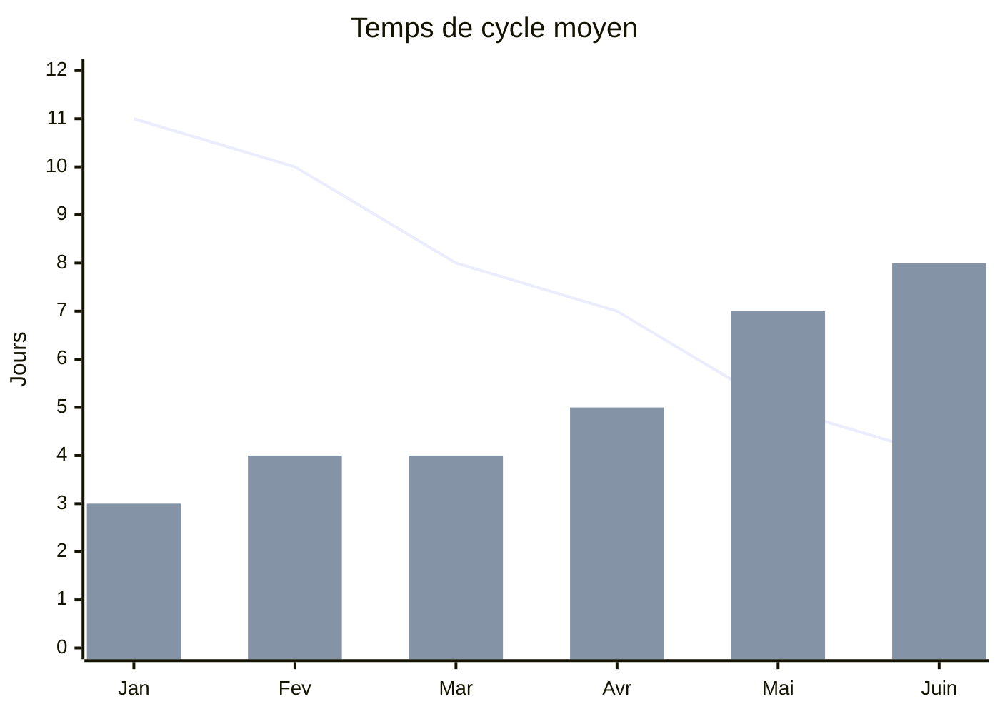
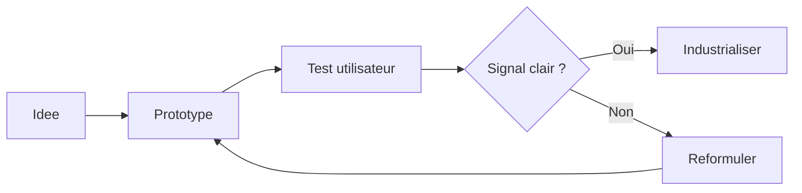

# Base complete Slidev

Une presentation de reference avec texte, image, tableau, graphique, code, timeline et slides de synthese.

<div class="mt-10 text-sm opacity-70">
Local rehearsal · 16 juin 2026 · Francais
</div>

<!--
Objectif: disposer d'une base plus riche qu'un deck minimal, facile a adapter pour une vraie conference.
-->

---
layout: center
glow: bottom
---

# Le message

Une bonne presentation ne se contente pas d'empiler des slides : elle organise une progression.

<div class="grid grid-cols-3 gap-4 mt-10">
  <div class="rounded-lg bg-white/70 border border-slate-200 p-5 shadow-sm">
    <div class="text-sm uppercase tracking-wide opacity-55">1</div>
    <h3 class="mt-2 mb-1">Contexte</h3>
    <p class="text-sm opacity-75">Pourquoi le sujet compte maintenant.</p>
  </div>
  <div class="rounded-lg bg-white/70 border border-slate-200 p-5 shadow-sm">
    <div class="text-sm uppercase tracking-wide opacity-55">2</div>
    <h3 class="mt-2 mb-1">Tension</h3>
    <p class="text-sm opacity-75">Ce qui bloque, coute, ralentit ou complique.</p>
  </div>
  <div class="rounded-lg bg-white/70 border border-slate-200 p-5 shadow-sm">
    <div class="text-sm uppercase tracking-wide opacity-55">3</div>
    <h3 class="mt-2 mb-1">Resolution</h3>
    <p class="text-sm opacity-75">La proposition et son impact concret.</p>
  </div>
</div>

---
layout: default
glow: right
---

# Agenda

<div class="grid grid-cols-[1fr_2fr] gap-10 mt-8 items-start">
  <div>
    <p class="text-lg opacity-75">Une structure simple pour tester plusieurs formes de contenu sans repartir de zero.</p>
  </div>
  <div class="space-y-4">
    <div v-click class="flex gap-4 items-start">
      <div class="text-blue-600 font-bold">01</div>
      <div><strong>Installer le contexte</strong><br><span class="opacity-65">Probleme, audience, enjeux.</span></div>
    </div>
    <div v-click class="flex gap-4 items-start">
      <div class="text-blue-600 font-bold">02</div>
      <div><strong>Montrer la matiere</strong><br><span class="opacity-65">Photo, chiffres, tableau, schema.</span></div>
    </div>
    <div v-click class="flex gap-4 items-start">
      <div class="text-blue-600 font-bold">03</div>
      <div><strong>Rendre l'idee actionnable</strong><br><span class="opacity-65">Processus, code, decisions, suite.</span></div>
    </div>
  </div>
</div>

---
layout: section
glow: left
---

# 1. Contexte

Partir du probleme avant de parler de solution.

---
layout: image-right
image: https://images.unsplash.com/photo-1497366811353-6870744d04b2?auto=format&fit=crop&w=1200&q=80
glow: top
---

# Une situation concrete

Les equipes produisent souvent plusieurs types de contenus pour expliquer une meme idee.

- Des messages courts pour cadrer
- Des preuves visuelles pour ancrer
- Des donnees pour objectiver
- Des exemples pour rendre la suite executable

<div class="mt-8 text-sm opacity-60">
Photo: espace de travail collaboratif, Unsplash.
</div>

<!--
Utiliser cette slide pour poser une situation reconnaissable par l'audience.
-->

---
layout: two-cols-header
glow: bottom
---

# Deux facons de raconter

::left::

## Centree outil

- Liste de fonctionnalites
- Beaucoup de detail
- Peu de hierarchie
- Difficile a retenir

::right::

## Centree decision

- Probleme explicite
- Critere de choix
- Exemple observable
- Prochaine action claire

---
layout: default
glow: right
---

# Signaux a observer

| Signal | Question | Exemple de preuve |
|---|---|---|
| Adoption | Qui utilise vraiment la solution ? | Sessions actives, retours terrain |
| Qualite | Le resultat est-il fiable ? | Taux d'erreur, revue humaine |
| Vitesse | Le delai baisse-t-il ? | Temps de cycle, temps de build |
| Confiance | L'equipe ose-t-elle s'en servir ? | Decisions prises sans escalation |

<div class="mt-6 text-sm opacity-65">
Un tableau fonctionne bien quand il compare peu de criteres, mais les compare vraiment.
</div>

---
layout: section
glow: right
---

# 2. Donnees et visualisation

Passer de l'opinion a une lecture partagee.

---
layout: default
glow: top
---

# Graphique Mermaid



<div class="grid grid-cols-2 gap-6 mt-8">
  <div>
    <h3 class="mb-1">Lecture</h3>
    <p class="opacity-75">Le temps de cycle diminue pendant que le nombre de livraisons augmente.</p>
  </div>
  <div>
    <h3 class="mb-1">Attention</h3>
    <p class="opacity-75">Un graphique ne suffit pas : il faut aussi dire ce que l'on decide a partir de lui.</p>
  </div>
</div>

---
layout: default
glow: left
---

# Processus



<div class="mt-8 rounded-lg bg-white/70 border border-slate-200 p-5">
Un schema est utile quand il rend visibles les boucles, les criteres d'arret et les responsabilites.
</div>

---
layout: default
glow: bottom
---

# Timeline

<div class="relative mt-10 pl-8 border-l-2 border-blue-500/30 space-y-8">
  <div v-click>
    <div class="absolute -left-2.5 w-5 h-5 rounded-full bg-blue-600"></div>
    <h3 class="mb-1">Semaine 1 · Cadrage</h3>
    <p class="opacity-70">Aligner audience, probleme et definition du succes.</p>
  </div>
  <div v-click>
    <div class="absolute -left-2.5 w-5 h-5 rounded-full bg-coral-500"></div>
    <h3 class="mb-1">Semaine 2 · Prototype</h3>
    <p class="opacity-70">Construire juste assez pour tester la comprehension.</p>
  </div>
  <div v-click>
    <div class="absolute -left-2.5 w-5 h-5 rounded-full bg-emerald-500"></div>
    <h3 class="mb-1">Semaine 3 · Decision</h3>
    <p class="opacity-70">Comparer les signaux et choisir la suite.</p>
  </div>
</div>

---
layout: section
glow: bottom
---

# 3. Exemples actionnables

Montrer comment l'idee se transforme en travail concret.

---
layout: default
glow: left
---

# Exemple de code

```ts {all|1-7|9-16|18-22}
type TalkSignal = {
  adoption: number
  quality: number
  speed: number
  confidence: number
}

function score(signal: TalkSignal) {
  return (
    signal.adoption * 0.3
    + signal.quality * 0.3
    + signal.speed * 0.2
    + signal.confidence * 0.2
  )
}

const decision = score({
  adoption: 8,
  quality: 7,
  speed: 6,
  confidence: 8,
})
```

<div class="mt-5 text-sm opacity-65">
Les zones surlignees permettent d'expliquer progressivement sans changer de slide.
</div>

---
layout: default
glow: right
---

# Bloc de decision

<div class="grid grid-cols-2 gap-6 mt-8">
  <div class="rounded-lg bg-white/75 border border-slate-200 p-6">
    <h3>Decision</h3>
    <p class="text-2xl font-semibold mt-3">Passer en beta privee</p>
    <p class="opacity-70 mt-3">Le signal est suffisant pour tester avec un public limite.</p>
  </div>
  <div class="rounded-lg bg-white/75 border border-slate-200 p-6">
    <h3>Garde-fous</h3>
    <ul class="mt-3">
      <li>Limiter a 20 utilisateurs</li>
      <li>Mesurer les echecs critiques</li>
      <li>Prevoir une sortie manuelle</li>
    </ul>
  </div>
</div>

---
layout: quote
glow: top
---

> Une slide doit reduire l'effort de comprehension, pas prouver que le sujet est complexe.

<div class="mt-6 text-sm opacity-60">Principe de conception pour cette base.</div>

---
layout: default
glow: bottom
---

# Checklist finale

<div class="grid grid-cols-2 gap-x-10 gap-y-5 mt-8">
  <div v-click class="flex gap-3">
    <div class="text-emerald-600 font-bold">✓</div>
    <div><strong>Un fil narratif</strong><br><span class="opacity-65">Contexte, tension, resolution.</span></div>
  </div>
  <div v-click class="flex gap-3">
    <div class="text-emerald-600 font-bold">✓</div>
    <div><strong>Des formats varies</strong><br><span class="opacity-65">Image, tableau, graphique, schema, code.</span></div>
  </div>
  <div v-click class="flex gap-3">
    <div class="text-emerald-600 font-bold">✓</div>
    <div><strong>Des preuves lisibles</strong><br><span class="opacity-65">Peu de chiffres, mais bien interpretes.</span></div>
  </div>
  <div v-click class="flex gap-3">
    <div class="text-emerald-600 font-bold">✓</div>
    <div><strong>Une prochaine action</strong><br><span class="opacity-65">Ce que l'audience peut faire juste apres.</span></div>
  </div>
</div>

---
layout: end
glow: top
---

# Merci

Questions, remarques, objections.
