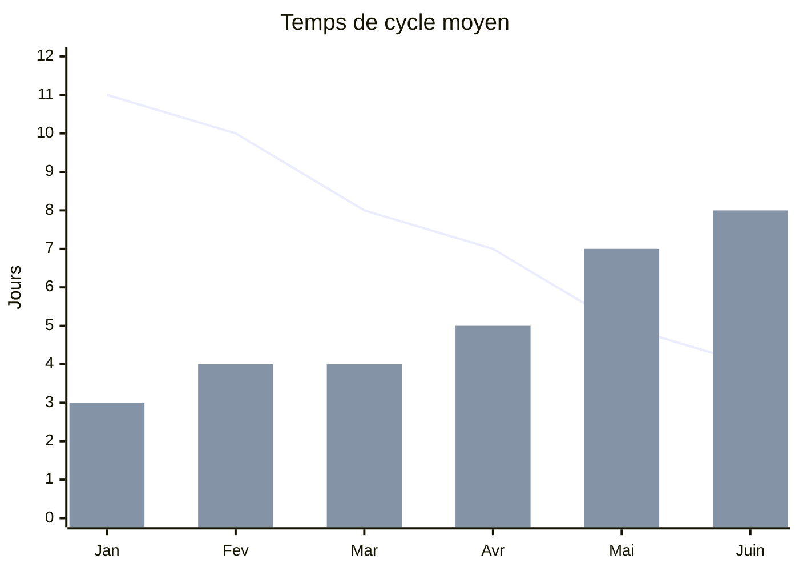
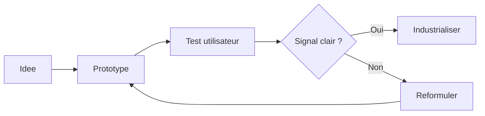

<div text-sm op50 tracking-widest uppercase mb-4>Local rehearsal · 16 juin 2026 · Français</div>

# Base complète Slidev

<div op50 text-xl mt-4>
Une présentation de référence : texte, image, tableau, graphique, code et synthèse.
</div>

<div mt-10 flex="~ gap-2 wrap">
  <div class="chip"><div i-ph-text-aa-duotone text-blue-600 /> Texte</div>
  <div class="chip"><div i-ph-image-duotone text-lime-600 /> Image</div>
  <div class="chip"><div i-ph-chart-line-up-duotone text-amber-600 /> Données</div>
  <div class="chip"><div i-ph-code-duotone text-purple-600 /> Code</div>
</div>

<!--
Objectif: disposer d'une base plus riche qu'un deck minimal, facile à adapter pour une vraie conférence.
-->

---
layout: center
glow: bottom
class: text-center
---

<div text-4xl leading-relaxed>
Une bonne présentation organise<br>une <span text-rose-600>progression</span>
</div>

<div op50 text-xl mt-6 v-click>
Elle ne se contente pas d'empiler des slides.
</div>

---
class: text-2xl
glow: right
---

# Le fil narratif

<div grid="~ cols-[max-content_min-content_auto] items-center gap-x-10 gap-y-10" py10>
  <div flex="~ gap-2 items-center" text-blue-600 v-click>
    <div i-ph-compass-duotone text-2xl />
    <span>Contexte</span>
  </div>
  <div i-ph-arrow-right-duotone op50 v-click />
  <div text-lg op75 v-after>pourquoi le sujet compte maintenant</div>

  <div flex="~ gap-2 items-center" text-amber-600 v-click>
    <div i-ph-lightning-duotone text-2xl />
    <span>Tension</span>
  </div>
  <div i-ph-arrow-right-duotone op50 v-click />
  <div text-lg op75 v-after>ce qui bloque, coûte, ralentit ou complique</div>

  <div flex="~ gap-2 items-center" text-lime-600 v-click>
    <div i-ph-check-circle-duotone text-2xl />
    <span>Résolution</span>
  </div>
  <div i-ph-arrow-right-duotone op50 v-click />
  <div text-lg op75 v-after>la proposition et son impact concret</div>
</div>

---
layout: center
glow: left
---

<div flex="~ col gap-2 items-center" text-center>
  <div op50 text-sm tracking-widest uppercase>Partie 1</div>
  <div text-5xl class="module-word" mt2>Contexte</div>
  <div op50 text-xl mt3>Partir du problème avant de parler de solution</div>
</div>

---
layout: image-right
image: https://images.unsplash.com/photo-1497366811353-6870744d04b2?auto=format&fit=crop&w=1200&q=80
glow: top
---

# Une situation concrète

<div op50 text-lg mt-2>Les équipes produisent plusieurs types de contenus pour expliquer une même idée.</div>

<div flex="~ col gap-4" mt-8 text-lg>
  <div flex="~ gap-2 items-center" v-click><div i-ph-chat-circle-text-duotone text-blue-600 /> des messages courts pour cadrer</div>
  <div flex="~ gap-2 items-center" v-click><div i-ph-image-duotone text-lime-600 /> des preuves visuelles pour ancrer</div>
  <div flex="~ gap-2 items-center" v-click><div i-ph-chart-bar-duotone text-amber-600 /> des données pour objectiver</div>
  <div flex="~ gap-2 items-center" v-click><div i-ph-play-circle-duotone text-purple-600 /> des exemples pour rendre la suite exécutable</div>
</div>

<div mt-8 text-sm op50>
Photo : espace de travail collaboratif, Unsplash.
</div>

<!--
Utiliser cette slide pour poser une situation reconnaissable par l'audience.
-->

---
layout: none
class: h-full
glow: bottom
---

<div h-full grid="~ rows-2">

<div p14>
  <h2 text-3xl mb-2>Centrée outil</h2>
  <div text-xl text-rose-600 v-click="1">une liste de fonctionnalités</div>
  <div mt-3 op75 text-lg v-click="2">beaucoup de détail, peu de hiérarchie — difficile à retenir</div>
</div>

<div p14 border="t gray-400/20">
  <h2 text-3xl mb-2>Centrée décision</h2>
  <div text-xl text-lime-600 v-click="3">un problème explicite, un critère de choix</div>
  <div mt-3 op75 text-lg v-click="4">un exemple observable, une prochaine action claire</div>
</div>
</div>

---
glow: right
---

# Signaux à observer

| Signal | Question | Exemple de preuve |
|---|---|---|
| Adoption | Qui utilise vraiment la solution ? | Sessions actives, retours terrain |
| Qualité | Le résultat est-il fiable ? | Taux d'erreur, revue humaine |
| Vitesse | Le délai baisse-t-il ? | Temps de cycle, temps de build |
| Confiance | L'équipe ose-t-elle s'en servir ? | Décisions prises sans escalade |

<div mt-6 text-sm op50>
Un tableau fonctionne bien quand il compare peu de critères, mais les compare vraiment.
</div>

---
layout: center
glow: right
---

<div flex="~ col gap-2 items-center" text-center>
  <div op50 text-sm tracking-widest uppercase>Partie 2</div>
  <div text-5xl class="module-word" mt2>Données & visualisation</div>
  <div op50 text-xl mt3>Passer de l'opinion à une lecture partagée</div>
</div>

---
glow: top
---

# Graphique Mermaid



<div grid="~ cols-2 gap-12" mt-6 text-lg>
  <div v-click>
    <div text-lime-600>Lecture</div>
    <div op50 text-base mt1>le temps de cycle diminue pendant que les livraisons augmentent</div>
  </div>
  <div v-click>
    <div text-amber-600>Attention</div>
    <div op50 text-base mt1>un graphique ne suffit pas : dire ce que l'on décide à partir de lui</div>
  </div>
</div>

---
glow: left
---

# Processus



<div mt-8 op50 text-lg v-click>
Un schéma est utile quand il rend visibles les boucles, les critères d'arrêt et les responsabilités.
</div>

---
glow: bottom
---

# Timeline

<div flex="~ col gap-9" mt-12 text-xl>
  <div flex="~ gap-4 items-start" v-click>
    <div i-ph-number-circle-one-duotone text-blue-600 text-3xl flex-none />
    <div>
      <div>Semaine 1 · Cadrage</div>
      <div op50 text-base mt1>aligner audience, problème et définition du succès</div>
    </div>
  </div>
  <div flex="~ gap-4 items-start" v-click>
    <div i-ph-number-circle-two-duotone text-lime-600 text-3xl flex-none />
    <div>
      <div>Semaine 2 · Prototype</div>
      <div op50 text-base mt1>construire juste assez pour tester la compréhension</div>
    </div>
  </div>
  <div flex="~ gap-4 items-start" v-click>
    <div i-ph-number-circle-three-duotone text-purple-600 text-3xl flex-none />
    <div>
      <div>Semaine 3 · Décision</div>
      <div op50 text-base mt1>comparer les signaux et choisir la suite</div>
    </div>
  </div>
</div>

---
layout: center
glow: left
---

<div flex="~ col gap-2 items-center" text-center>
  <div op50 text-sm tracking-widest uppercase>Partie 3</div>
  <div text-5xl class="module-word" mt2>Exemples actionnables</div>
  <div op50 text-xl mt3>Transformer l'idée en travail concret</div>
</div>

---
glow: left
---

# Exemple de code

```ts {all|1-7|9-16|18-22|all}
type TalkSignal = {
  adoption: number
  quality: number
  speed: number
  confidence: number
}

function score(signal: TalkSignal) {
  return (
    signal.adoption * 0.3
    + signal.quality * 0.3
    + signal.speed * 0.2
    + signal.confidence * 0.2
  )
}

const decision = score({
  adoption: 8,
  quality: 7,
  speed: 6,
  confidence: 8,
})
```

<div mt-5 text-sm op50>
Les zones surlignées permettent d'expliquer progressivement sans changer de slide.
</div>

---
layout: center
glow: right
class: text-center
---

<div op50 text-lg mb-2>La décision</div>

<div text-4xl>Passer en <span class="module-word" text-rose-600>bêta privée</span></div>

<div mt-10 flex="~ gap-3 items-center justify-center wrap" text-lg>
  <div class="chip" v-click><div i-ph-users-three-duotone text-blue-600 /> 20 utilisateurs max</div>
  <div class="chip" v-click><div i-ph-warning-circle-duotone text-amber-600 /> mesurer les échecs critiques</div>
  <div class="chip" v-click><div i-ph-hand-palm-duotone text-rose-600 /> sortie manuelle prévue</div>
</div>

---
layout: quote
glow: top
---

> Une slide doit réduire l'effort de compréhension, pas prouver que le sujet est complexe.

<div mt-6 text-sm op50>Principe de conception pour cette base.</div>

---
layout: center
glow: bottom
class: text-center
---

<div op50 text-lg mb-8>Checklist finale</div>

<div flex="~ col gap-5 items-start" text-2xl mx-auto w-max>
  <div v-click>un fil narratif <span op30>→</span> <span op50 text-lg>contexte, tension, résolution</span></div>
  <div v-click>des formats variés <span op30>→</span> <span op50 text-lg>image, tableau, graphique, code</span></div>
  <div v-click>des preuves lisibles <span op30>→</span> <span op50 text-lg>peu de chiffres, bien interprétés</span></div>
  <div v-click>une prochaine action <span op30>→</span> <span op50 text-lg>ce que l'audience fait juste après</span></div>
</div>

---
layout: center
glow: top
class: text-center
---

<h1 class="module-word" important-text-3em>Merci</h1>

<div op50 mt-4>Questions, remarques, objections.</div>
